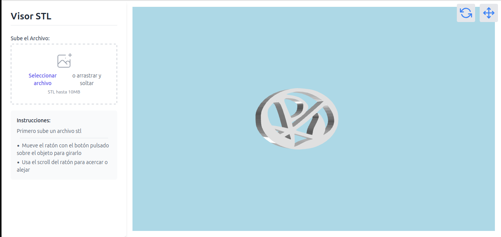

# Visualizador de Archivos SLT / HTML view STL

Este proyecto proporciona una plantilla HTML que permite cargar y visualizar archivos SLT (SubRip Subtitle) de manera sencilla y eficiente.

## Características
- **Carga de Archivos**: Permite a los usuarios cargar archivos SLT desde su dispositivo.
- **Visualización**: Muestra el contenido del archivo SLT en un formato legible.
- **Interfaz Amigable**: Diseño sencillo y fácil de usar.

  

## Cómo Usar

Abre el Archivo HTML:
Navega hasta el directorio del proyecto y abre el archivo index.html en tu navegador.

Carga un Archivo SLT:
Usa la interfaz para cargar y visualizar tu archivo SLT.